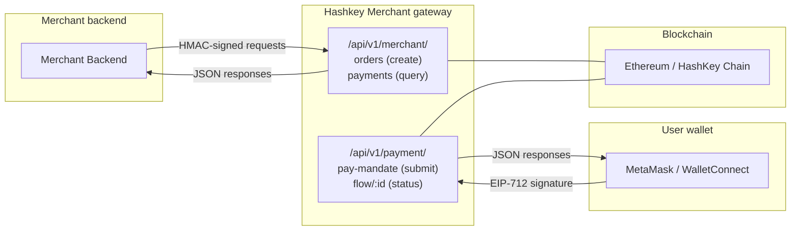
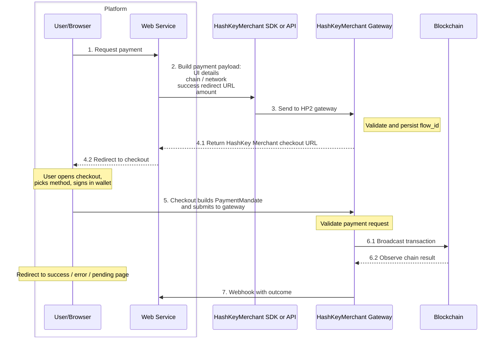

# HashKey Merchant

> A crypto payment gateway for merchants, supporting on-chain payments with stablecoins such as USDC and USDT.

HashKey Merchant is a complete cryptocurrency payment solution that gives merchants secure, efficient on-chain payment capabilities.

Through standardized RESTful APIs, your backend can quickly create payment orders, query payment status, and receive final payment outcomes in real time via webhooks.

---

## Key features

| Feature | Description |
|---------|-------------|
| **One-time payment orders** | For e-commerce checkouts, one-off fees, and similar flows—each order maps to a single payment |
| **Reusable payment orders** | For device rental, vending, subscription charges—multiple independent payments under one mandate |
| **Webhook notifications** | Push callbacks after a terminal state, with HMAC-SHA256 verification and up to 6 exponential-backoff retries |
| **Multi-chain & multi-asset** | Ethereum, HashKey Chain, and more; USDC, USDT, and other major stablecoins |
| **HMAC-SHA256 authentication** | All Merchant APIs are protected with HMAC signatures and replay protection |
| **ES256K JWT signing** | Merchant authorization uses secp256k1, aligned with the broader blockchain ecosystem |

---

## One-time vs reusable payment orders

| Aspect | One-time order | Reusable order |
|--------|----------------|----------------|
| **Typical use** | E-commerce, one-off fees, online purchases | Device rental, vending, subscription charges |
| **Payments** | One `cart_mandate_id` → one payment | One `cart_mandate_id` → many payments |
| **Create** | `POST /merchant/orders` | `POST /merchant/orders/reusable` |
| **Query** | `GET /merchant/payments` | `GET /merchant/payments/reusable` |
| **`cart_expiry` guidance** | ~2 hours | Cover the full business lifecycle (e.g. 365 days) |

---

## System architecture

---

## End-to-end payment flow

1. **Create order** — `POST /api/v1/merchant/orders` to create a Cart Mandate; receive `payment_url` and `flow_id`
2. **Guide the user** — Share `payment_url` (redirect, QR code, email, etc.)
3. **User signs** — User completes EIP-712 authorization in the wallet
4. **Submit payment** — Frontend submits the PaymentMandate
5. **On-chain processing** — Gateway builds and broadcasts the transaction, tracks confirmations
6. **Outcome** — Webhook to your server and/or poll the payment APIs

---

## Core ID model

| ID | Alias | Producer | Meaning |
|----|-------|----------|---------|
| `cart_mandate_id` | ID1 | Merchant | Order or device identifier—one mandate per order/device authorization |
| `payment_request_id` | ID2 | Merchant | Payment request id; for one-time orders, pairs 1:1 with `cart_mandate_id` |
| `flow_id` | ID3 | Gateway | Checkout flow id; used in `payment_url` and status queries |
| `payment_mandate_id` | ID4 = ID2 | Frontend | Same as `payment_request_id`; links mandate back to the cart |
| `request_id` | ID5 | Frontend | Unique line-item id generated on the client |

---

## Cart Mandate & Payment Mandate

**Cart Mandate** and **Payment Mandate** in HashKey Merchant align with the *Verifiable Digital Credentials (VDCs)* model in the **Agent Payments Protocol (AP2)**: standardized, cryptographically bound objects that express merchant and user authorization and the scope of a transaction. See the full definitions, actors, and journeys in the official spec: [AP2 specification](https://ap2-protocol.org/specification/).

In **HashKey Merchant**, the terms mean the following:

**Cart Mandate** is the **payment request and authorization that the merchant initiates in our system**—the order your backend creates (amount, chain, asset, payee, and related fields), submitted to the gateway together with merchant-side signing such as `merchant_authorization`.

**Payment Mandate** is the **user’s authorization to execute the payment / on-chain transfer based on that Cart Mandate**—what the shopper produces at checkout when they sign with their wallet, consenting to move funds under the conditions described in the Cart Mandate.

For fields and flows specific to this product, see [Building a Cart Mandate](cart-mandate.md) and [API reference](api-reference.md).

---

## Quick links

- **[Merchant onboarding](onboarding.md)** — Keys, registration, credentials
- **[Authentication & signing](authentication.md)** — HMAC-SHA256 + ES256K JWT
- **[API reference](api-reference.md)** — All Merchant endpoints
- **[Cart Mandate](cart-mandate.md)** — Schema, Canonical JSON, signing
- **[Webhooks](webhook.md)** — Payloads, signature verification, retries
- **[Go SDK](sdk.md)** — Install, config, examples
- **[Appendix](appendix.md)** — Error codes, networks, changelog
- **AP2 spec (external)** — [ap2-protocol.org/specification](https://ap2-protocol.org/specification/)
