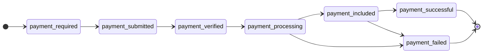

# Building a Cart Mandate

The Cart Mandate is the core payload: order metadata, payment methods, line items, and the merchant JWT.

---

## Full structure

```json
{
  "cart_mandate": {
    "contents": {
      "id": "ORDER-001",
      "user_cart_confirmation_required": true,
      "payment_request": {
        "method_data": [{
          "supported_methods": "https://www.x402.org/",
          "data": {
            "x402Version": 2,
            "network": "sepolia",
            "chain_id": 11155111,
            "contract_address": "0x1c7D...",
            "pay_to": "0x99c1...",
            "coin": "USDC"
          }
        }],
        "details": {
          "id": "PAY-REQ-001",
          "display_items": [
            {"label": "Item A", "amount": {"currency": "USD", "value": "10.00"}},
            {"label": "Item B", "amount": {"currency": "USD", "value": "5.00"}}
          ],
          "total": {
            "label": "Total",
            "amount": {"currency": "USD", "value": "15.00"}
          }
        }
      },
      "cart_expiry": "2024-03-01T12:00:00Z",
      "merchant_name": "My Store"
    },
    "merchant_authorization": "eyJhbG..."
  },
  "redirect_url": "https://yoursite.com/redirect"
}
```

---

## Field reference

### `contents`

| Field | Type | Required | Description |
|-------|------|----------|-------------|
| `id` | string | Yes | `cart_mandate_id` (ID1) |
| `user_cart_confirmation_required` | bool | Yes | Require shopper confirmation |
| `payment_request` | object | Yes | Payment details |
| `cart_expiry` | string | Yes | RFC 3339 expiry |
| `merchant_name` | string | Yes | Display name |

### `method_data`

Each `method_data` entry describes one accepted payment method. The gateway currently supports the **x402** protocol; the fields below cover `method_data` and its nested `data` object.

| Field | Type | Required | Description |
|-------|------|----------|-------------|
| `supported_methods` | string | Yes | `"https://www.x402.org/"` |
| `data.x402Version` | int | Yes | `2` |
| `data.network` | string | Yes | e.g. `sepolia`, `ethereum` |
| `data.chain_id` | int | Yes | Chain id |
| `data.contract_address` | string | Yes | Token contract |
| `data.pay_to` | string | Yes | Payee |
| `data.coin` | string | Yes | `USDC`, `USDT`, … |

> [!TIP]
> Multiple `method_data` entries enable multi-chain / multi-token checkout.

### `details`

| Field | Type | Required | Description |
|-------|------|----------|-------------|
| `id` | string | Yes | `payment_request_id` (ID2) |
| `display_items` | array | No | Line items |
| `total` | object | Yes | Total with `label` + `amount` |
| `shipping_options` | array | No | Shipping options |
| `modifiers` | array | No | Modifiers |

### `cart_expiry` guidance

| Scenario | Suggested | Notes |
|----------|-----------|-------|
| One-time (e-commerce) | ~2 hours | Covers normal checkout time |
| Reusable (rental, etc.) | ≥365 days | Must span the business lifecycle |

> [!IMPORTANT]
> Short `cart_expiry` expires the mandate. A 2-hour window on a reusable mandate blocks next-day charges.

---

## Canonical JSON

`cart_hash` uses **Canonical JSON** on `cart_mandate.contents` per [RFC 8785](https://www.rfc-editor.org/rfc/rfc8785).

### Rules

1. Sort object keys recursively (lexicographic)
2. Compact serialization (no extra whitespace)
3. SHA-256 the string → 64 hex chars

### Pseudocode

```javascript
function sortKeys(val) {
  if (val === null || typeof val !== "object") return val;
  if (Array.isArray(val)) return val.map(sortKeys);
  const sorted = {};
  for (const key of Object.keys(val).sort()) {
    sorted[key] = sortKeys(val[key]);
  }
  return sorted;
}

function hashCanonicalJSON(obj) {
  const jsonStr = JSON.stringify(sortKeys(obj));
  return hex(SHA256(jsonStr));
}
```

### Example

Input:

```json
{
  "merchant_name": "My Store",
  "id": "cart-123",
  "cart_expiry": "2024-03-01T12:00:00Z"
}
```

Canonical string:

```
{"cart_expiry":"2024-03-01T12:00:00Z","id":"cart-123","merchant_name":"My Store"}
```

Hash it to obtain `cart_hash`.

---

## Signing pipeline

```
1. Build contents
        │
        ▼
2. Canonical JSON
        │
        ▼
3. SHA-256 → cart_hash
        │
        ▼
4. JWT claims (iss, sub, aud, iat, exp, jti, cart_hash)
        │
        ▼
5. ES256K sign → merchant_authorization
        │
        ▼
6. Body { cart_mandate, redirect_url? }
        │
        ▼
7. HMAC → X-Signature
        │
        ▼
8. POST /api/v1/merchant/orders
```

---

## Payment state machine



| State | Meaning | Terminal |
|-------|---------|----------|
| `payment-required` | Awaiting payer | No |
| `payment-submitted` | Authorization submitted | No |
| `payment-verified` | Authorization verified | No |
| `payment-processing` | On-chain in flight | No |
| `payment-included` | Included in a block; confirmations pending | No |
| `payment-successful` | Required confirmations met; successful execution | **Yes** |
| `payment-failed` | Failed | **Yes** |

> [!NOTE]
> Watch `payment-included`, `payment-successful`, and `payment-failed`.
>
> For small amounts or instant fulfillment, `payment-included` is often sufficient; rare reorgs can still fail the tx—otherwise wait for `payment-successful` (often ~20–60 minutes).
>
> `payment-successful` / `payment-failed` are the true terminal states.
