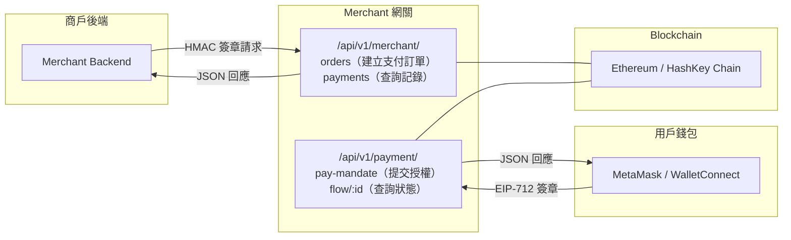
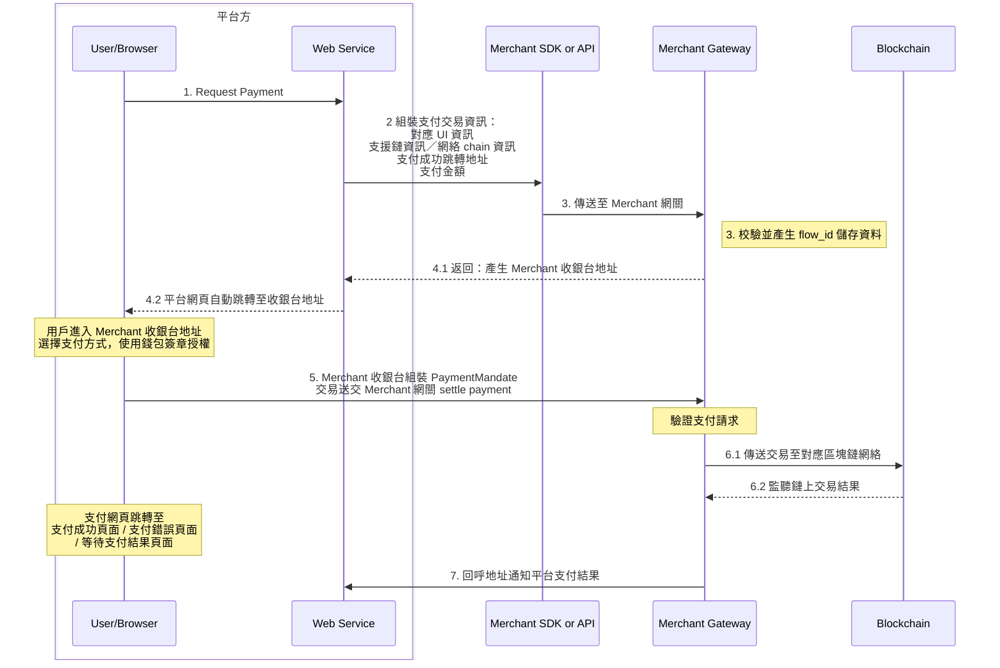

# HashKey Merchant

> 專為商戶而設的加密貨幣支付網關，支援 USDC / USDT 等穩定幣鏈上支付。

HashKey Merchant 是一套完整的加密貨幣支付方案，為商戶提供安全、高效率的鏈上支付能力。

商戶後端透過標準化的 RESTful API，可快速建立支付訂單、查詢支付狀態，並透過 Webhook 即時接收支付結果通知。

---

## 核心功能

| 功能 | 說明 |
|------|------|
| **單次支付訂單** | 適用於網購、一次性繳費等場景，每筆訂單獨立發起一次支付 |
| **可重複支付訂單** | 適用於裝置租賃、自動販賣、訂閱扣款，同一授權下可發起多筆獨立支付 |
| **Webhook 即時通知** | 支付達終態後主動推送回呼，支援 HMAC-SHA256 簽章驗證，最多 6 次指數退避重試 |
| **多鏈多幣種** | 支援 Ethereum、HashKey Chain 等多鏈網絡，涵蓋 USDC、USDT 等主流穩定幣 |
| **HMAC-SHA256 認證** | 所有 Merchant API 均透過 HMAC 簽章保障安全，防重放攻擊 |
| **ES256K JWT 簽章** | 使用 secp256k1 曲線簽署商戶授權，與區塊鏈生態一致 |

---

## 單次支付訂單 vs 可重複支付訂單

| 維度 | 單次支付訂單 | 可重複支付訂單 |
|------|-----------|-----------|
| **適用場景** | 網購、一次性繳費、網上消費 | 裝置租賃、自動販賣、訂閱扣款 |
| **支付次數** | 一個 `cart_mandate_id` 對應一次支付 | 一個 `cart_mandate_id` 下可發起多次支付 |
| **建立 API** | `POST /merchant/orders` | `POST /merchant/orders/reusable` |
| **查詢 API** | `GET /merchant/payments` | `GET /merchant/payments/reusable` |
| **cart_expiry 建議** | 約 2 小時 | 涵蓋整個業務生命週期（如 365 天） |

---

## 系統架構

---

## 支付全流程

1. **商戶建立支付訂單** — 呼叫 `POST /api/v1/merchant/orders` 建立 Cart Mandate，取得 `payment_url` 與 `flow_id`
2. **引導用戶支付** — 將 `payment_url` 傳送給用戶（前端跳轉、QR Code、電郵等）
3. **用戶簽署授權** — 用戶在支付頁面透過錢包完成 EIP-712 簽章授權
4. **提交支付** — 前端自動提交 PaymentMandate
5. **鏈上處理** — 網關組裝鏈上交易並廣播，自動追蹤確認狀態
6. **結果通知** — 透過 Webhook 回呼商戶，或商戶主動查詢支付狀態

---

## 核心 ID 體系

系統使用多個 ID 識別支付流程中的不同實體，理解 ID 體系是對接的基礎：

| ID 名稱 | 識別 | 產生方 | 說明 |
|---------|------|--------|------|
| `cart_mandate_id` | ID1 | 商戶 | 訂單 / 裝置唯一識別，代表一筆支付訂單或一個裝置的支付授權 |
| `payment_request_id` | ID2 | 商戶 | 支付請求識別，單次支付訂單下與 `cart_mandate_id` 一一對應 |
| `flow_id` | ID3 | 網關 | 支付流程 ID，用於組裝 `payment_url` 並查詢支付狀態 |
| `payment_mandate_id` | ID4 = ID2 | 前端 | 等於 `payment_request_id`，用於 payment_mandate 回溯 cart_mandate |
| `request_id` | ID5 | 前端 | 支付明細唯一識別，由前端產生的隨機 ID |

---

## Cart Mandate 與 Payment Mandate

HashKey Merchant 所採用的 **Cart Mandate** 與結帳／鏈上流程中的 **Payment Mandate**，與 **Agent Payments Protocol（AP2）** 規範下的可驗證數位憑證（Verifiable Digital Credentials, VDC）框架對齊：以標準化、可簽署的資料結構表達商戶與用戶的授權與交易範圍。完整術語、角色與流程見官方規格：[AP2 specification](https://ap2-protocol.org/specification/)。

於 **HashKey Merchant** 本系統內，兩者語意如下：

**Cart Mandate** 代表商戶經由本平台**發起的支付請求與授權**——即商戶後端建立訂單、載明金額／鏈／幣種等條件，並透過 API 與商戶簽章（如 `merchant_authorization`）提交予網關的一整套「購物車／支付意圖」資料。

**Payment Mandate** 代表**用戶依該 Cart Mandate** 在結帳流程中，以錢包完成簽署後所產生的**支付／鏈上轉帳授權**——即用戶同意按 Cart Mandate 所載條件執行實際扣款或鏈上轉帳。

本系統欄位與流程細節以 [Cart Mandate 組裝](cart-mandate.md) 及 [API 文件](api-reference.md) 為準。

---

## 快速連結

- **[商戶對接流程](onboarding.md)** — 註冊、金鑰產生、憑證取得
- **[認證與簽章](authentication.md)** — HMAC-SHA256 簽章 + ES256K JWT
- **[API 文件](api-reference.md)** — 全部 Merchant API 參考
- **[Cart Mandate 組裝](cart-mandate.md)** — 資料結構、Canonical JSON、簽章
- **[Webhook 回呼](webhook.md)** — 回呼格式、簽章驗證、重試機制
- **[附錄](appendix.md)** — 錯誤碼、支援網絡、更新日誌
- **AP2 規格（外部）** — [ap2-protocol.org/specification](https://ap2-protocol.org/specification/)
