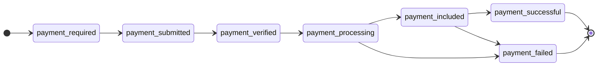

# Cart Mandate 組裝

Cart Mandate 是核心支付請求資料結構，包含訂單資訊、支付方式、金額明細與商戶簽章。

---

## 完整資料結構

```json
{
  "cart_mandate": {
    "contents": {
      "id": "ORDER-001",                         // cart_mandate_id (ID1)
      "user_cart_confirmation_required": true,
      "payment_request": {
        "method_data": [{                         // 支付方式清單
          "supported_methods": "https://www.x402.org/",
          "data": {
            "x402Version": 2,
            "network": "sepolia",
            "chain_id": 11155111,
            "contract_address": "0x1c7D...",
            "pay_to": "0x99c1...",                // 收款地址
            "coin": "USDC"
          }
        }],
        "details": {
          "id": "PAY-REQ-001",                    // payment_request_id (ID2)
          "display_items": [                      // 商品明細
            {"label": "商品 A", "amount": {"currency": "USD", "value": "10.00"}},
            {"label": "商品 B", "amount": {"currency": "USD", "value": "5.00"}}
          ],
          "total": {                              // 總金額
            "label": "總計",
            "amount": {"currency": "USD", "value": "15.00"}
          }
        }
      },
      "cart_expiry": "2024-03-01T12:00:00Z",      // RFC 3339 過期時間
      "merchant_name": "My Store"
    },
    "merchant_authorization": "eyJhbG..."          // ES256K JWT
  },
  "redirect_url": "https://yoursite.com/redirect"  // 選填
}
```

---

## 欄位詳解

### contents（購物車內容）

| 欄位 | 類型 | 必填 | 說明 |
|------|------|------|------|
| `id` | string | 是 | 訂單唯一識別（`cart_mandate_id`，ID1），商戶自訂 |
| `user_cart_confirmation_required` | bool | 是 | 是否需要用戶確認購物車 |
| `payment_request` | object | 是 | 支付請求資訊 |
| `cart_expiry` | string | 是 | 授權過期時間（RFC 3339 格式） |
| `merchant_name` | string | 是 | 商戶名稱 |

### method_data（支付方式）

每個 `method_data` 項定義一種可接受的支付方式。現時支援 **x402** 協議；下方為相關欄位說明：

| 欄位 | 類型 | 必填 | 說明 |
|------|------|------|------|
| `supported_methods` | string | 是 | 固定為 `"https://www.x402.org/"` |
| `data.x402Version` | int | 是 | 固定為 `2` |
| `data.network` | string | 是 | 網絡名稱（如 `sepolia`、`ethereum`） |
| `data.chain_id` | int | 是 | 鏈 ID（如 `11155111`） |
| `data.contract_address` | string | 是 | 代幣合約地址 |
| `data.pay_to` | string | 是 | 收款地址 |
| `data.coin` | string | 是 | 代幣符號（如 `USDC`、`USDT`） |

> [!TIP]
> 可設定多個 `method_data` 項以支援多鏈／多幣種支付，用戶於支付頁面選擇。

### details（支付明細）

| 欄位 | 類型 | 必填 | 說明 |
|------|------|------|------|
| `id` | string | 是 | 支付請求 ID（`payment_request_id`，ID2） |
| `display_items` | array | 否 | 商品明細清單，每項包含 `label` 與 `amount` |
| `total` | object | 是 | 總金額，包含 `label` 與 `amount`（`currency` + `value`） |
| `shipping_options` | array | 否 | 配送選項 |
| `modifiers` | array | 否 | 支付修改器 |

### cart_expiry 有效期建議

| 場景 | 建議值 | 說明 |
|------|--------|------|
| **單次支付訂單**（網購） | 2 小時 | 涵蓋用戶完成支付的合理時間範圍 |
| **可重複支付訂單**（裝置租賃） | 365 天或更長 | 涵蓋整個業務生命週期 |

> [!IMPORTANT]
> `cart_expiry` 設定過短會導致支付授權過期。可重複支付訂單場景若設定 2 小時，翌日即無法發起新支付。

---

## Canonical JSON 規範

計算 `cart_hash` 時，需對 `cart_mandate.contents` 進行 **Canonical JSON** 序列化，遵循 [RFC 8785](https://www.rfc-editor.org/rfc/rfc8785) 標準。

### 規則

1. **鍵名排序** — 遞迴地對所有物件的鍵按字母順序遞增排序
2. **緊湊格式** — 不包含空格、換行等格式化字元
3. **雜湊計算** — 對排序後的 JSON 字串計算 SHA-256 雜湊，結果為 64 位十六進制字串

### 虛擬碼

```javascript
function sortKeys(val) {
  if (val === null || typeof val !== "object") return val;
  if (Array.isArray(val)) return val.map(sortKeys);
  const sorted = {};
  for (const key of Object.keys(val).sort()) {
    sorted[key] = sortKeys(val[key]);
  }
  return sorted;
}

function hashCanonicalJSON(obj) {
  const jsonStr = JSON.stringify(sortKeys(obj));
  return hex(SHA256(jsonStr));
}
```

### 範例

原始 contents 物件（未排序）：

```json
{
  "merchant_name": "My Store",
  "id": "cart-123",
  "cart_expiry": "2024-03-01T12:00:00Z"
}
```

規範化後（按鍵字母排序、緊湊格式）：

```
{"cart_expiry":"2024-03-01T12:00:00Z","id":"cart-123","merchant_name":"My Store"}
```

對上述字串計算 SHA-256 即得到 `cart_hash`（64 位十六進制字串）。

---

## 簽章完整流程

```
1. 組裝 Cart Contents (contents 物件)
         │
         ▼
2. Canonical JSON 序列化 (遞迴排序鍵 → 緊湊 JSON)
         │
         ▼
3. 計算 SHA-256 雜湊 → cart_hash
         │
         ▼
4. 組裝 JWT Claims (iss, sub, aud, iat, exp, jti, cart_hash)
         │
         ▼
5. 以商戶私鑰簽署 ES256K JWT → merchant_authorization
         │
         ▼
6. 組裝請求本文 { cart_mandate: { contents, merchant_authorization }, redirect_url }
         │
         ▼
7. 以 app_secret 計算 HMAC 簽章 → X-Signature
         │
         ▼
8. POST /api/v1/merchant/orders
```

---

## 支付狀態機



| 狀態 | 說明 | 終態 |
|------|------|------|
| `payment-required` | 支付要求已建立，等待用戶支付 | 否 |
| `payment-submitted` | 用戶已提交支付授權 | 否 |
| `payment-verified` | 支付授權已驗證 | 否 |
| `payment-processing` | 鏈上交易處理中 | 否 |
| `payment-included` | 鏈上交易已打包（交易已被礦工打包進區塊，但尚未達到足夠的區塊確認數） | 否 |
| `payment-successful` | 支付完成（鏈上交易已達所需確認數，`tx_signature` 已寫入且交易執行成功） | **是** |
| `payment-failed` | 支付失敗 | **是** |

> [!NOTE]
> 商戶需關注 `payment-included`／`payment-successful`／`payment-failed` 三個狀態。
>
> `payment-included` 在小額支付／即時使用場景下即可視為支付成功；極少數情況會因區塊回滾導致交易失敗，其他情況可等待 `successful` 狀態，通常約 20 分鐘至 1 小時。
>
> `payment-successful`／`payment-failed` 代表支付的最終狀態。
