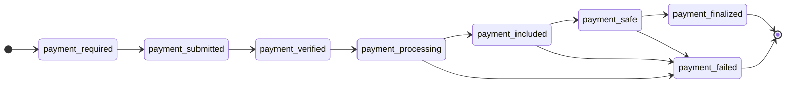

# Cart Mandate 組裝

Cart Mandate 是核心支付請求資料結構，包含訂單資訊、支付方式、金額明細與商戶簽章。

---

## 完整資料結構

```json
{
  "cart_mandate": {
    "contents": {
      "id": "ORDER-001",
      "user_cart_confirmation_required": true,
      "payment_request": {
        "method_data": [
          {
            "supported_methods": "https://www.x402.org/",
            "data": {
              "x402Version": 2,
              "network": "sepolia",
              "chain_id": 11155111,
              "contract_address": "0x1c7D...",
              "pay_to": "0x99c1...",
              "coin": "USDC"
            }
          },
          {
            "supported_methods": "https://www.x402.org/",
            "data": {
              "x402Version": 2,
              "network": "sepolia",
              "chain_id": 11155111,
              "contract_address": "0x3f3F...",
              "pay_to": "0x99c1...",
              "coin": "USDT"
            }
          }
        ],
        "details": {
          "id": "PAY-REQ-001",
          "display_items": [
            {
              "label": "商品 A",
              "amount": { "currency": "USD", "value": "10.00" }
            },
            {
              "label": "商品 B",
              "amount": { "currency": "USD", "value": "5.00" }
            }
          ],
          "total": {
            "label": "總計",
            "amount": { "currency": "USD", "value": "15.00" }
          },
          "modifiers": [
            {
              "total": { "currency": "USD", "value": "16.00" },
              "additional_display_items": [
                {
                  "label": "服務費",
                  "amount": { "currency": "USD", "value": "1.00" },
                  "pending": true,
                  "refund_period": 0
                }
              ],
              "data": {
                "method_data_indexes": [0, 1]
              }
            }
          ]
        }
      },
      "cart_expiry": "2024-03-01T12:00:00Z",
      "merchant_name": "My Store"
    },
    "merchant_authorization": "eyJhbG..."
  },
  "redirect_url": "https://yoursite.com/redirect"
}
```

---

## 欄位詳解

### contents（購物車內容）

| 欄位                              | 類型   | 必填 | 說明                                             |
| --------------------------------- | ------ | ---- | ------------------------------------------------ |
| `id`                              | string | 是   | 訂單唯一識別（`cart_mandate_id`，ID1），商戶自訂 |
| `user_cart_confirmation_required` | bool   | 是   | 是否需要用戶確認購物車                           |
| `payment_request`                 | object | 是   | 支付請求資訊                                     |
| `cart_expiry`                     | string | 是   | 授權過期時間（RFC 3339 格式）                    |
| `merchant_name`                   | string | 是   | 商戶名稱                                         |

### method_data（支付方式）

每個 `method_data` 項定義一種可接受的支付方式。現時支援 **x402** 協議；下方為相關欄位說明：

| 欄位                    | 類型   | 必填 | 說明                                 |
| ----------------------- | ------ | ---- | ------------------------------------ |
| `supported_methods`     | string | 是   | 固定為 `"https://www.x402.org/"`     |
| `data.x402Version`      | int    | 是   | 固定為 `2`                           |
| `data.network`          | string | 是   | 網絡名稱（如 `sepolia`、`ethereum`） |
| `data.chain_id`         | int    | 是   | 鏈 ID（如 `11155111`）               |
| `data.contract_address` | string | 是   | 代幣合約地址                         |
| `data.pay_to`           | string | 是   | 收款地址                             |
| `data.coin`             | string | 是   | 代幣（如 `USDC`、`USDT`）        |

> [!TIP]
> 可設定多個 `method_data` 項以支援多鏈／多幣種支付，用戶於支付頁面選擇。

### details（支付明細）

| 欄位               | 類型   | 必填 | 說明                                                     |
| ------------------ | ------ | ---- | -------------------------------------------------------- |
| `id`               | string | 是   | 支付請求 ID（`payment_request_id`，ID2）                 |
| `display_items`    | array  | 否   | 商品明細清單，每項包含 `label` 與 `amount`               |
| `total`            | object | 是   | 商品總金額，包含 `label` 與 `amount`（`currency` + `value`） |
| `shipping_options` | array  | 否   | 配送選項                                                 |
| `modifiers`        | array  | 否   | 支付修改器                                               |

### modifiers（支付修改器）

支付修改器可為指定支付方式在商品金額上加入額外費用。每個修改器包含以下欄位：

| 欄位 | 類型 | 必填 | 說明 |
| ---- | ---- | ---- | ---- |
| `modifiers[].total` | object | 是 | 加入額外費用後的最終支付金額（`currency` + `value`） |
| `modifiers[].additional_display_items` | array | 是 | 額外費用清單；可傳入多項，Checkout 頁面會匯總顯示 |
| `modifiers[].additional_display_items[].label` | string | 是 | 額外費用說明 |
| `modifiers[].additional_display_items[].amount` | object | 是 | 額外費用金額（`currency` + `value`） |
| `modifiers[].additional_display_items[].pending` | bool | 是 | 固定為 `true` |
| `modifiers[].additional_display_items[].refund_period` | int | 是 | 暫不支援；請設為 `0` |
| `modifiers[].data` | object | 是 | 支付方式匹配資料 |
| `modifiers[].data.method_data_indexes` | int array | 是 | `payment_request.method_data` 的零起始索引 |

`details.total`、`display_items`、修改器 `total` 及 `additional_display_items` 的幣種均固定為 `USD`。

#### 金額校驗

支付網關會按以下規則校驗金額：

1. 每個修改器須符合 `modifier.total.value = details.total.amount.value + sum(modifier.additional_display_items[].amount.value)`。
2. 如有傳入 `display_items`，須符合 `sum(details.display_items[].amount.value) = details.total.amount.value`。

在完整示例中，商品金額為 `15.00`、額外費用為 `1.00`，最終支付金額為 `16.00`。

#### 支付方式匹配

`data.method_data_indexes` 指定外層 `payment_request.method_data` 陣列中可使用此修改器的支付方式。每個值必須是該陣列內有效的零起始索引；只有用戶選擇的支付方式匹配其中一個索引時，才會套用此修改器。

例如，`[0, 1]` 會匹配完整示例中的兩種支付方式。當 `method_data` 只有兩項時，索引 `-1` 和 `2` 均無效。

### cart_expiry 有效期建議

| 場景                           | 建議值       | 說明                           |
| ------------------------------ | ------------ | ------------------------------ |
| **單次支付訂單**（網購）       | 2 小時       | 涵蓋用戶完成支付的合理時間範圍 |
| **可重複支付訂單**（裝置租賃） | 365 天或更長 | 涵蓋整個業務生命週期           |

> [!IMPORTANT]
> `cart_expiry` 設定過短會導致支付授權過期。可重複支付訂單場景若設定 2 小時，翌日即無法發起新支付。

---

## Canonical JSON 規範

計算 `cart_hash` 時，需對 `cart_mandate.contents` 進行 **Canonical JSON** 序列化，遵循 [RFC 8785](https://www.rfc-editor.org/rfc/rfc8785) 標準。

### 規則

1. **鍵名排序** — 遞迴地對所有物件的鍵按字母順序遞增排序
2. **緊湊格式** — 不包含空格、換行等格式化字元
3. **雜湊計算** — 對排序後的 JSON 字串計算 SHA-256 雜湊，結果為 64 位十六進制字串

### 虛擬碼

```javascript
function sortKeys(val) {
  if (val === null || typeof val !== "object") return val;
  if (Array.isArray(val)) return val.map(sortKeys);
  const sorted = {};
  for (const key of Object.keys(val).sort()) {
    sorted[key] = sortKeys(val[key]);
  }
  return sorted;
}

function hashCanonicalJSON(obj) {
  const jsonStr = JSON.stringify(sortKeys(obj));
  return hex(SHA256(jsonStr));
}
```

### 範例

原始 contents 物件（未排序）：

```json
{
  "merchant_name": "My Store",
  "id": "cart-123",
  "cart_expiry": "2024-03-01T12:00:00Z"
}
```

規範化後（按鍵字母排序、緊湊格式）：

```
{"cart_expiry":"2024-03-01T12:00:00Z","id":"cart-123","merchant_name":"My Store"}
```

對上述字串計算 SHA-256 即得到 `cart_hash`（64 位十六進制字串）。

---

## 簽章完整流程

```
1. 組裝 Cart Contents (contents 物件)
         │
         ▼
2. Canonical JSON 序列化 (遞迴排序鍵 → 緊湊 JSON)
         │
         ▼
3. 計算 SHA-256 雜湊 → cart_hash
         │
         ▼
4. 組裝 JWT Claims (iss, sub, aud, iat, exp, jti, cart_hash)
         │
         ▼
5. 以商戶私鑰簽署 ES256K JWT → merchant_authorization
         │
         ▼
6. 組裝請求本文 { cart_mandate: { contents, merchant_authorization }, redirect_url }
         │
         ▼
7. 以 app_secret 計算 HMAC 簽章 → X-Signature
         │
         ▼
8. POST /api/v1/merchant/orders
```

---

## 支付狀態機



| 狀態                   | 說明                                       | 終態   |
| ---------------------- | ------------------------------------------ | ------ |
| `payment-required`     | 支付要求已建立，等待用戶支付               | 否     |
| `payment-submitted`    | 用戶已提交支付授權                         | 否     |
| `payment-verified`     | 支付授權已驗證                             | 否     |
| `payment-processing`   | 鏈上交易處理中                             | 否     |
| `payment-included`     | 交易已打包，等待安全確認或最終性確認       | 否     |
| `payment-safe`         | 交易已達安全確認塊數，區塊重組風險極低     | 否     |
| `payment-finalized`    | 區塊最終性已確認，交易不可逆               | **是** |
| `payment-failed`       | 支付失敗                                   | **是** |

> [!NOTE]
> 商戶需關注 `payment-included`／`payment-safe`／`payment-finalized`／`payment-failed` 四個狀態。
>
> **區塊重組**（chain reorganization，簡稱 reorg）：區塊鏈出現分叉且較長鏈取代現有鏈時，較短鏈上已確認的交易可能被撤銷。
>
> `payment-included` 在小額支付／即時使用場景下即可視為支付成功；`payment-safe` 表示已達安全確認深度，區塊重組風險極低，適合一般金額；高風險或需絕對不可逆時，請等待 `payment-finalized`。
>
> `payment-finalized`／`payment-failed` 代表支付的最終狀態。
